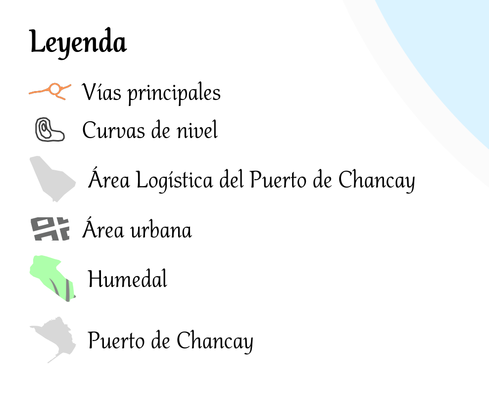
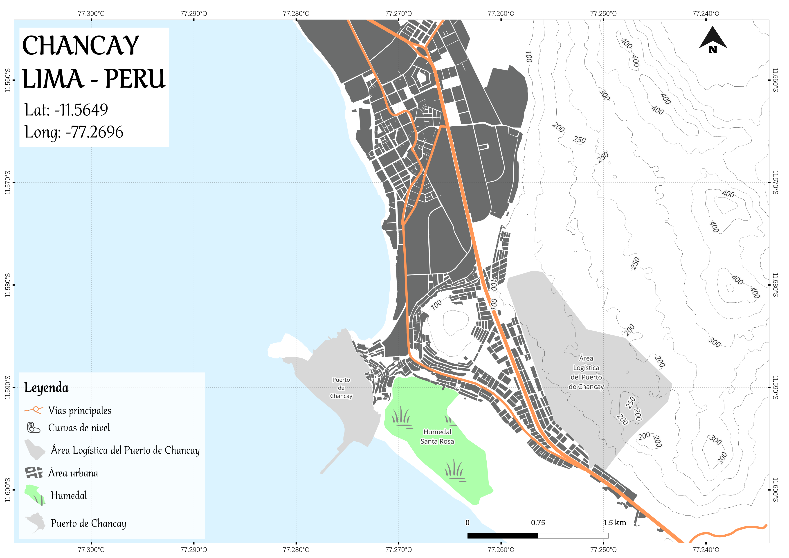
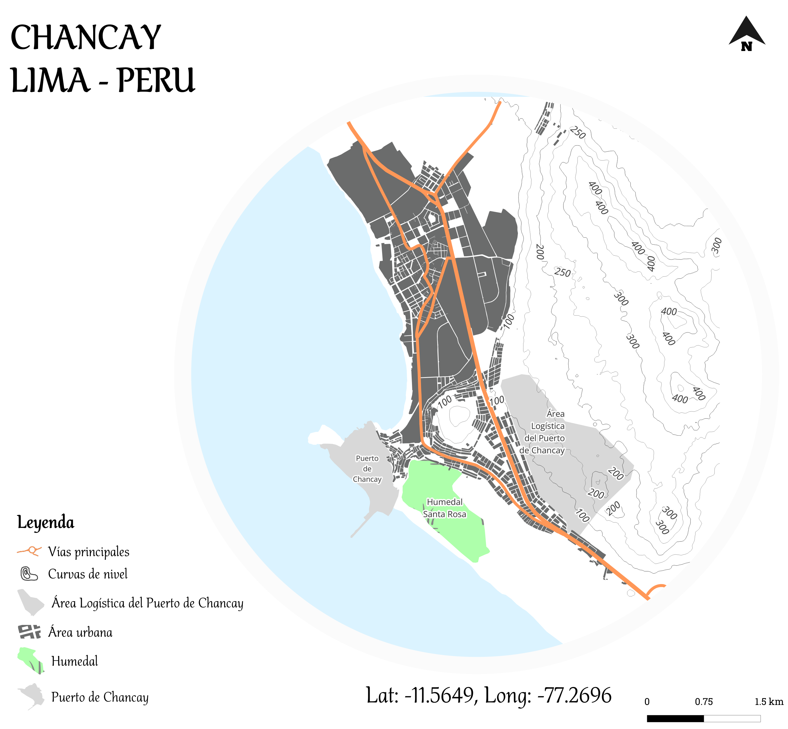

¿Quieres llevar tus leyendas de QGIS al siguiente nivel 👀? 🗺️✨ 

En este repositorio 🗂️ encontrarás algunos truquitos y expresiones que pueden potenciar tu visualización de mapas en QGIS, sobre todo te ayudará a crear tus propios estilos (**patch shape**)  para tus propios diseños cartográficos 🎨🌐.
Si eres un apasionado de la cartografía y deseas profundizar tus conocimientos en QGIS, te invito a ver el video completo en mi canal de Youtube 🎥 tocando está temática.

¡Enteráte más y aprender conmigo! 🔍💡 Suscríbete, activa las notificaciones 🔔 y únete a la comunidad que ama el software libre. 🌟🌍 👇
- https://www.youtube.com/@geografope
- https://github.com/geografope

## 🟢 Resultados

 
<table>
 <tr>
   <td>Formal</td>
   <td>Artístico</td>
 </tr>
 <tr>
   <td></td>
   <td></td>
 </tr>
</table>

## 🟢 Referencias
- *https://plugins.qgis.org/styles/types/Legend%20Patch/*
- *https://septima.dk/nyheder/QGIS-legend-patches*
